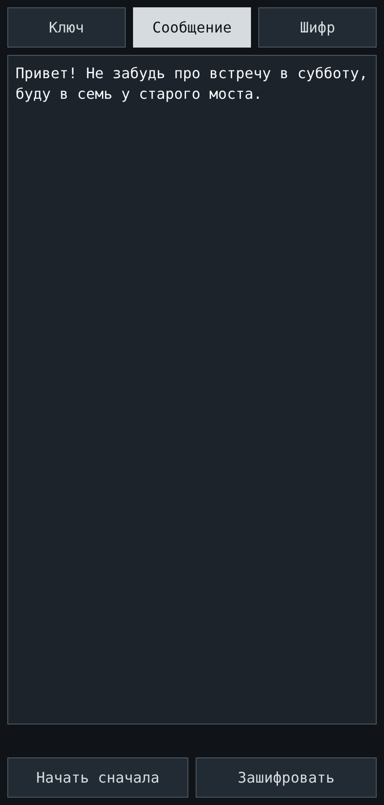
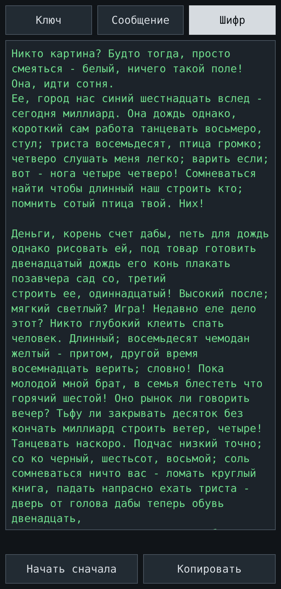

# max-copy-paste

Encrypt and decrypt messages with a symmetric key — and let the result look like ordinary
(if slightly broken) Russian text instead of a base64 blob. One HTML file, no server, no
network, works offline on a phone. The UI is in Russian.

<p align="center">
  
  &nbsp;&nbsp;&nbsp;&nbsp;
  
  &nbsp;&nbsp;&nbsp;&nbsp;
  
</p>

## What it does

The app has three tabs and one large text field:

| Tab | What it holds | Buttons |
|---|---|---|
| **Ключ** | the 256-bit symmetric key | `Перезаписать ключ` |
| **Сообщение** | your plaintext | `Начать сначала`, `Зашифровать`, `Копировать` |
| **Шифр** | the look-alike cypher text | `Начать сначала`, `Расшифровать` or `Копировать` |

The cypher text is a piece of Russian prose that makes no sense: common nouns, verbs and
adjectives carry the encrypted bytes, short service words and numerals are random noise,
and punctuation is sprinkled in so it reads like a badly written note. It survives
copy-pasting through chat apps and e-mail, and a casual glance sees nothing interesting.

## How to use

1. **Share the key.** On first launch the app generates a 256-bit key and shows it on the
   **Ключ** tab. Both sides need the same key — read it out, photograph it, or paste it
   through a channel you trust. `Перезаписать ключ` saves whatever is in the field; an
   empty field generates a fresh key.
2. **Encrypt.** Type the message on **Сообщение** and press `Зашифровать`. After the
   spinner the cypher text appears on **Шифр**; `Копировать` puts it on the clipboard —
   send it as an ordinary message.
3. **Decrypt.** Paste the received text on **Шифр** and press `Расшифровать`. The message
   appears on **Сообщение** and `Зашифровать` disables; `Копировать` copies the plaintext.
   `Начать сначала` clears the working fields and resets the buttons.

## How it works

1. The message is encoded as UTF-8 and encrypted with **AES-256-GCM** (random 12-byte IV,
   16-byte authentication tag).
2. Every byte of `IV ‖ ciphertext ‖ tag` becomes one word from **CYPHERBOOK**, a table of
   256 common Russian words — word index = byte value.
3. Words from **NOISE**, a second table of 256 short service words and numerals, are
   randomly sprinkled between them.
4. Punctuation (`, ; - . ! ?`), line breaks and capitals at sentence starts are added on
   top; they carry no information.

Decryption goes in reverse: punctuation is stripped, everything is lower-cased, noise
words are dropped, the remaining words map back to bytes, and AES-GCM verifies and
decrypts. Re-typing the text — changing case, spacing or punctuation — does not hurt, but
an unknown word is rejected instead of being silently mangled.

A 100-character message becomes roughly 3 KB of text: the camouflage costs about 30× in
size.

## The key

- 256 bits, shown as 4 lines of 4 hex groups:
  ```
  a3f1 c02b 9d4e 7712
  00aa 5b3c d9e8 4f20
  31c0 7e4a bb19 5d63
  84fe 20a7 6cb4 0f91
  ```
- It lives only in the browser's `localStorage` (`mcp.key.v1`) and is never sent anywhere.
  If the browser refuses storage, the key survives only until the page is closed — the app
  says so in the status line.
- Anyone who has the key and this app can read your messages. `Перезаписать ключ` with an
  empty field generates a new key; messages encrypted with the old one can no longer be
  decrypted.

## Security notes and limitations

- The page carries `Content-Security-Policy: default-src 'none'; connect-src 'none'; …` —
  no fetch, no XHR, no CDN, no fonts, no images. Everything is inline in the single file,
  and the only network-capable code is none at all.
- The disguise is camouflage, **not** steganography and **not** plausible deniability. The
  security comes from AES-256-GCM; the words only make the traffic look boring. The word
  tables are part of the app, so anyone who has the file can turn the text back into bytes —
  they still need the key to read anything.
- Web Crypto needs a secure context: open the file via `https://` or `file://`. On `file://`
  some browsers restrict `localStorage`; the app falls back to memory and warns.
- Clipboard access works on a tap (`Копировать`); where the API is missing or denied, select
  the text and copy it manually — the app says so.
- Do not lose the key, and do not encrypt two different conversations with one key if you
  care who can read what.

## Development

`max_copy_paste.html` is the whole application: `<style>`, markup and one `<script>`. It is
kept human-readable and is meant to be minified by hand later.

- The two word tables sit at the top of the script as plain word lists. Invariants, checked
  at startup by the app itself: 256 + 256 words, every word unique across both tables,
  plain Cyrillic, one word per byte value. If they break, the status line says
  «Таблицы слов повреждены».
- Keep every table word free of `ё`, hyphens and digits — the decoder strips everything
  that is not a Russian letter before matching.
- There is no build step and no dependency. Open the file, read it, change it.

## License

Apache-2.0 — see [LICENSE](LICENSE).
