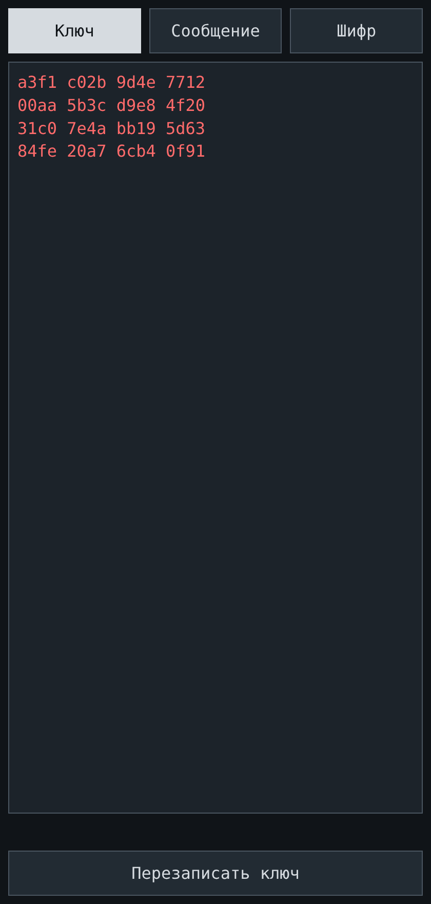
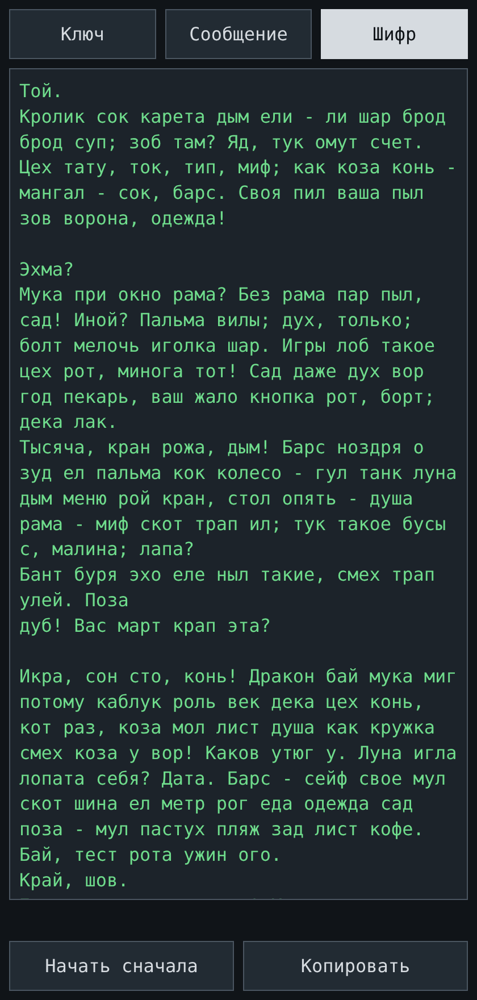

# max-copy-paste

Отправляйте секретные сообщения, которые выглядят как обычный (пусть и слегка поломанный)
русский текст. Один HTML-файл, без установки, без интернета — откройте его в браузере на
телефоне или ноутбуке и работайте офлайн. Интерфейс на русском языке.

<p align="left">
  
  
  
</p>

## Быстрый старт

1. Откройте `max_copy_paste.html` в браузере — двойным щелчком или отправьте файл себе на
   телефон и откройте там.
2. Один раз задайте ключ и передайте тот же ключ собеседнику
   (см. [Настройка ключа](#настройка-ключа)).
3. Напишите сообщение, нажмите `Зашифровать`, скопируйте результат и отправьте его как любой
   другой текст (см. [Шифрование сообщения](#шифрование-сообщения-пошагово)).
4. Получив такой текст, вставьте его и нажмите `Расшифровать`
   (см. [Дешифрование сообщения](#дешифрование-сообщения-пошагово)).

В приложении три вкладки и одно большое текстовое поле:

| Вкладка | Что в ней хранится |
|---|---|
| **Ключ** | ваш секретный ключ |
| **Сообщение** | сообщение открытым текстом |
| **Шифр** | замаскированный текст — его вы отправляете и получаете |

## Настройка ключа

Ключ — это общий секрет. Обе стороны должны использовать один и тот же ключ: кто знает ключ
и имеет этот файл, тот прочитает всё, что им зашифровано, а без ключа не прочитает никто.

### Первый запуск: ключ создаётся автоматически

1. Откройте приложение. При самом первом запуске оно окажется на вкладке **Ключ** и покажет
   только что сгенерированный ключ: 4 строки по 4 hex-группы, красным цветом.
2. Отправьте этот ключ собеседнику — продиктуйте его по телефону, сфотографируйте, запишите.
   Используйте канал, которому вы доверяете.
3. Готово. Ключ сохранён в вашем браузере и с этого момента будет загружаться автоматически.

### Ввод полученного ключа

1. Перейдите на вкладку **Ключ**, очистите поле и введите или вставьте ключ. Переносы строк,
   пробелы и заглавные буквы не важны — приложение их вычистит.
2. Нажмите `Перезаписать ключ`. В строке состояния под полем появится «Ключ сохранён».
3. Если написано «Ключ должен содержать 64 hex-символа (0-9, a-f)» — ключ неполный,
   сверьтесь с собеседником.

### Получение нового ключа

1. На вкладке **Ключ** очистите поле и нажмите `Перезаписать ключ`. Появится новый случайный
   ключ, и он сразу сохранится.
2. Отправьте новый ключ собеседнику. **Сообщения, зашифрованные старым ключом, больше нельзя
   расшифровать никому** — включая вас.

## Шифрование сообщения (пошагово)

1. Откройте вкладку **Сообщение** и введите или вставьте сообщение.
2. Нажмите `Зашифровать` — на мгновение появится маленький индикатор.
3. Приложение переключится на вкладку **Шифр**. В поле окажется абзац странных русских слов
   с пунктуацией — это ваше замаскированное сообщение.
4. Нажмите `Копировать` — текст попадёт в буфер обмена (на кнопке мелькнёт «Скопировано»).
5. Вставьте его в любой мессенджер или письмо и отправьте. Он выглядит как обычный текст и
   переживает копирование-вставку.

## Дешифрование сообщения (пошагово)

1. Скопируйте полученный текст.
2. В приложении откройте вкладку **Шифр** и вставьте текст в поле. Не переживайте из-за
   пробелов, пунктуации и заглавных букв — если мессенджер перенёс строки по-своему,
   всё равно сработает.
3. Нажмите `Расшифровать` — на мгновение появится индикатор.
4. Приложение переключится на вкладку **Сообщение** и покажет сообщение. Нажмите `Копировать`,
   чтобы скопировать его в буфер обмена.

Кнопка `Зашифровать` в этот момент намеренно неактивна, чтобы расшифрованный текст случайно
не зашифровался заново. Измените текст или нажмите `Начать сначала`, когда захотите написать
что-то новое.

Если что-то пойдёт не так, строка состояния под полем скажет, что случилось:

| Сообщение | Что оно означает |
|---|---|
| «Похоже, это не шифротекст или он повреждён» | текст не наш, или часть слов потерялась по дороге |
| «Не удалось расшифровать (неверный ключ?)» | текст цел, но ваш ключ отличается от ключа отправителя |
| «Скопируйте текст вручную» | браузер отказал в доступе к буферу обмена — выделите текст и скопируйте сами |

## Полезно знать

- `Начать сначала` очищает оба рабочих поля и возвращает кнопки в исходное состояние. Ключ
  это никогда не затрагивает.
- Сообщение ограничено 100 символами; в строке состояния показан счётчик символов
  (`[30 / 100] символов`). Шифротекст не ограничивается.
- На вкладке **Ключ** в строке состояния показывается версия приложения (`Версия ПО: 1.00`).
- Используйте разные ключи для разных собеседников, если хотите иметь возможность закрыть
  один разговор, не теряя другой.
- Потеряли ключ — потеряли сообщения; передали ключ — передали сообщения.
- Приложению нужен `file://` или `https://` — только там браузеры предоставляют криптографию.

---

## Технические детали

### Конвейер шифрования

1. Сообщение кодируется в UTF-8 и шифруется с помощью **AES-256-GCM** (случайный 12-байтовый
   IV, 16-байтовый тег аутентификации).
2. Каждый байт `IV ‖ шифротекст ‖ тег` превращается в одно слово из **CYPHERBOOK** — таблицы
   из 256 русских слов: индекс слова = значение байта.
3. Слова из **NOISE** — второй таблицы из 256 служебных слов и числительных — в случайных
   местах подсыпаются между ними: около 20% слов в результате являются шумом.
4. Поверх добавляются пунктуация (`, ; - . ! ?`), переносы строк и заглавные буквы в начале
   предложений; информации они не несут.

Дешифрование идёт в обратную сторону: пунктуация удаляется, всё приводится к нижнему регистру,
шумовые слова отбрасываются, оставшиеся слова отображаются обратно в байты, а AES-GCM
проверяет подлинность и расшифровывает. Повторный набор текста — с другими регистрами,
пробелами или пунктуацией — не мешает, но неизвестное слово отклоняется, а не молча
перековеркивается.

### Таблицы слов

Обе таблицы построены с расчётом на размер: 80% слов короткие (2–5 букв, плюс горстка
служебных слов из одной буквы), остальные 20% — обычные слова подлиннее, чтобы текст не
выглядел телеграммой. Байты на выходе AES равномерно случайны, поэтому каждая ячейка таблицы
используется одинаково часто и имеет значение лишь средняя длина слова — приёма «короткое
слово для частого байта» здесь нет.

Инварианты, которые приложение само проверяет при запуске: 256 + 256 слов, каждое слово
уникально в обеих таблицах, чистая кириллица, одно слово на каждое значение байта, 256 слов
(205 длиной до 5 букв и 51 подлиннее) в каждой таблице. Если они нарушаются, строка состояния
показывает «Таблицы слов повреждены».

### Размер

Сообщение длиной 100 символов превращается примерно в 1,4 КБ текста: маскировка стоит
примерно 14-кратного раздувания размера (замерено; раньше было ~30×, пока таблицы не
сократили до коротких слов, а долю шума не урезали до 20%).

### Ключ

- 256 бит, отображается как 4 строки по 4 hex-группы:
  ```
  a3f1 c02b 9d4e 7712
  00aa 5b3c d9e8 4f20
  31c0 7e4a bb19 5d63
  84fe 20a7 6cb4 0f91
  ```
- Хранится только в `localStorage` браузера (`mcp.key.v1`) и никуда не отправляется. Если
  браузер отказывается сохранять, ключ живёт лишь до закрытия страницы — приложение
  предупреждает об этом в строке состояния.
- `Перезаписать ключ` с пустым полем генерирует новый случайный ключ.

### Модель безопасности и ограничения

- Страница несёт `Content-Security-Policy: default-src 'none'; connect-src 'none'; …` —
  никаких fetch, никаких XHR, никаких CDN, шрифтов и изображений. Всё встроено в единственный
  файл, а весь код, способный ходить в сеть, — это отсутствие такового.
- Маскировка — это камуфляж, **не** стеганография и **не** правдоподобное отрицание.
  Безопасность даёт AES-256-GCM; слова лишь делают трафик скучным на вид. Таблицы слов —
  часть приложения, так что любой, у кого есть файл, сможет превратить текст обратно в байты,
  но для чтения всё равно нужен ключ.
- AES-GCM даёт и целостность, и секретность: неверный ключ и подделанный текст оба громко
  проваливаются, а не выдают мусор.

### Разработка

`max_copy_paste.html` — это всё приложение: `<style>`, разметка и один `<script>`. Он
написан так, чтобы оставаться читаемым для человека, и в будущем предполагается сжать его
руками. Никакой сборки, никаких зависимостей.

- Две таблицы слов лежат в начале скрипта как простые списки слов.
- В каждом слове таблиц не должно быть `ё`, дефисов и цифр — декодер перед сопоставлением
  удаляет всё, что не является русской буквой.
- Откройте файл, прочитайте, измените.

### Лицензия

Apache-2.0 — см. [LICENSE](LICENSE).
